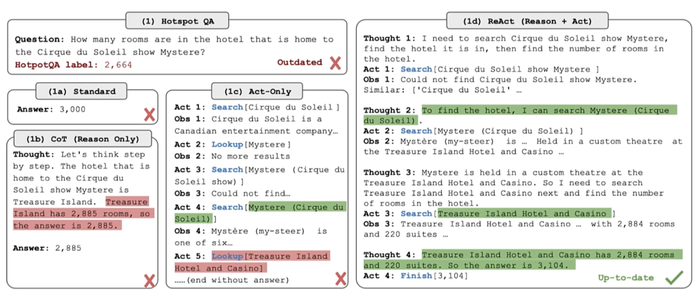

# LangGraph Playbook

## ReAct: Reasoning + Acting in Language Models



*Image Source: [Yao et al. (2023) ReAct: Synergizing Reasoning and Acting in Language Models](https://arxiv.org/abs/2210.03629)*

This paper introduced the idea of interleaving **reasoning traces** (thoughts) with **actions** in a loop, allowing LLMs to:

- Plan and adjust strategies dynamically
- Retrieve external information when needed
- Handle exceptions and recover from errors

## Getting Started

### Prerequisites

- Python 3.12+
- [uv](https://docs.astral.sh/uv/) (recommended) or pip

### Installation

1. **Clone the repository**
   ```bash
   git clone https://github.com/yourusername/langgraph_playbook.git
   cd langgraph_playbook
   ```

2. **Install dependencies**
   ```bash
   uv sync
   ```
   Or with pip:
   ```bash
   pip install -e .
   ```

3. **Set up environment variables**
   
   Create a `.env` file in the project root:
   ```bash
   cp .env.example .env
   ```
   
   Add your API keys:
   ```
   OPENAI_API_KEY=your_openai_api_key_here
   ```

### Running the Project

```bash
uv run python main.py
```

Or if using pip:
```bash
python main.py
```

### Jupyter Notebooks (Optional)

To explore interactively with Jupyter:
```bash
uv add --dev jupyterlab
jupyter lab
```
