# LangGraph Playbook

## Why Reasoning Matters for AI Agents

Reasoning is the cognitive process that enables decision-making and problem-solving. For AI agents, it's essential for:

- Interacting with complex, dynamic environments
- Breaking down tasks into subtasks and selecting optimal plans
- Adjusting plans based on new feedback or information

### How Agents Enhance Reasoning

| Technique | Purpose |
|-----------|---------|
| **ReAct Framework** | Integrates reasoning and acting for better decision-making |
| **Chain-of-Thought** | Encourages step-by-step reasoning in LLMs |
| **Tool Use** | Retrieves external information or performs calculations |
| **Task Decomposition** | Breaks complex problems into manageable subtasks |

**Reference:** [TypedDict vs Pydantic](typeddict_vs_pydantic.md)

## ReAct: Reasoning + Acting in Language Models

**ReAct = Reasoning + Acting** — A single-agent framework where the agent alternates between thinking (reasoning) and doing (acting) to solve tasks.


*Image Source: [Yao et al. (2023) ReAct: Synergizing Reasoning and Acting in Language Models](https://arxiv.org/abs/2210.03629)*

This paper introduced the idea of interleaving **reasoning traces** (thoughts) with **actions** in a loop, allowing LLMs to:

- Plan and adjust strategies dynamically
- Retrieve external information when needed
- Handle exceptions and recover from errors

### The ReAct Workflow

```mermaid
flowchart TD
    subgraph Agent["🤖 Agent"]
        T((Thought)) --> A((Action))
        A --> O((Observation))
        O --> T
    end
```



The agent runs in a continuous loop:
1. **Thought** — Reason about the current state and what to do next
2. **Action** — Execute a tool/function (e.g., search, calculate)
3. **Observation** — Receive the result and feed it back into thinking

### Why ReAct Works Better

**Accuracy on HotpotQA** (from the paper):

| Method | Exact Match |
|--------|-------------|
| Standard | 28.7% |
| Chain-of-Thought (CoT) | 29.4% |
| Act-only | 25.7% |
| ReAct | 27.4% |
| **ReAct + CoT** | **35.1%** |

**Hallucination Rates on HotpotQA**:

| Method | Hallucination Rate |
|--------|-------------------|
| Chain-of-Thought (CoT) | 14% |
| ReAct | 6% |

ReAct reduces hallucinations by grounding reasoning in external information retrieval.

### Examples of Tools

| Tool | Use Case |
|------|----------|
| **Search Engine API** | Retrieve the latest news articles on a topic to provide current information |
| **Customer Database** | Access a customer's order history to offer personalized recommendations |
| **Calendar API** | Schedule meetings by checking availability and sending calendar invites |
| **Payment Processing** | Process transactions when a user makes a purchase through a conversational agent |

## Getting Started

### Prerequisites

- Python 3.12+
- [uv](https://docs.astral.sh/uv/) (recommended) or pip

### Installation

1. **Clone the repository**
   ```bash
   git clone https://github.com/bipinjethwani/langgraph_playbook.git
   cd langgraph_playbook
   ```

2. **Install dependencies**
   ```bash
   uv sync
   ```
   Or with pip:
   ```bash
   pip install -e .
   ```

3. **Set up environment variables**
   
   Create a `.env` file in the project root:
   ```bash
   cp .env.example .env
   ```
   
   Add your API keys:
   ```
   OPENAI_API_KEY=your_openai_api_key_here
   ```

### Running the Project

```bash
uv run python main.py
```

Or if using pip:
```bash
python main.py
```

### Jupyter Notebooks (Optional)

To explore interactively with Jupyter:
```bash
uv run jupyter lab
```
