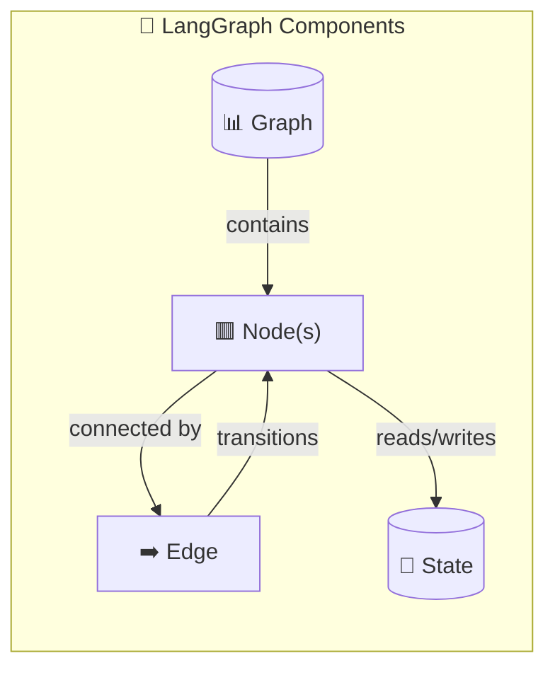
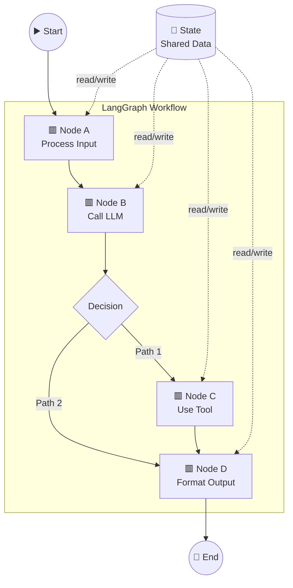
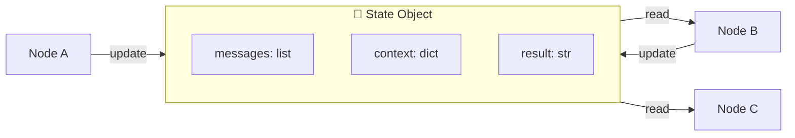
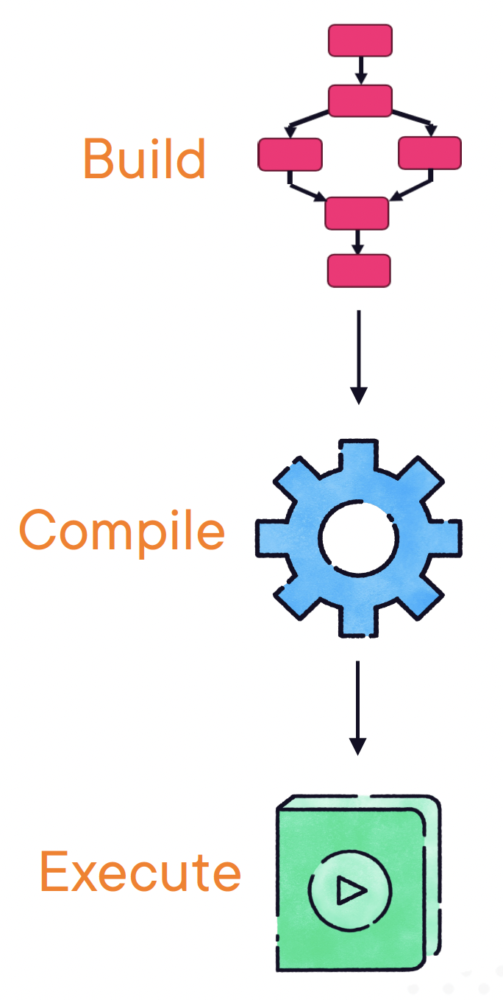

# Introduction to LangGraph

LangGraph is a framework for building **stateful, multi-step AI agent workflows** as graphs. It supports both **single-agent** and **multi-agent** architectures, providing fine-grained control over both the flow and state of your application.

---

## Core Components of LangGraph



| Component | Description |
|-----------|-------------|
| **Graph** | Visual representation of the entire workflow |
| **Node** | Represents a specific task or operation |
| **Edge** | Defines the control flow between nodes |
| **State** | Central data structure containing the workflow data |

---

## How It Works



1. **Entry Point** → Graph execution begins at a designated start node
2. **Node Execution** → Each node performs its task (LLM call, tool use, logic)
3. **State Updates** → Nodes read from and write to the shared state
4. **Edge Traversal** → Control flows to the next node based on edges
5. **Conditional Routing** → Edges can be conditional for dynamic workflows
6. **Completion** → Graph ends when it reaches a terminal node

---

## Understanding State

State is the **heart of LangGraph** — it's the shared memory that flows through your entire workflow.



### Key Characteristics

| Property | Description |
|----------|-------------|
| **Stores workflow data** | All information needed across the workflow |
| **Defined as TypedDict or Pydantic** | Type-safe state definition ([learn more](typeddict_vs_pydantic.md)) |
| **Accessible by all nodes** | Every node can read the current state |
| **Updated by nodes** | Nodes return state updates after execution |
| **Evolves over time** | State captures cumulative updates as workflow progresses |

### State Definition Example

```python
from typing import TypedDict, Annotated
from langgraph.graph.message import add_messages

class AgentState(TypedDict):
    messages: Annotated[list, add_messages]  # Chat history
    context: dict                             # Additional context
    final_answer: str                         # Output
```

---

## Build → Compile → Execute

LangGraph graphs must be **compiled** before execution. Here's the complete workflow:

<p align="center">
  
</p>

### 🔨 Build the Graph

| Step | Action |
|------|--------|
| 1 | **Define the state** — Create a TypedDict or Pydantic model |
| 2 | **Define Python functions** — Write the logic for each node |
| 3 | **Create the StateGraph** — Initialize with your state schema |
| 4 | **Add nodes** — Register functions as named nodes |
| 5 | **Set entry point** — Define where execution begins |
| 6 | **Connect with edges** — Link nodes together (including conditional edges) |

```
┌─────────────────────────────────────────────────┬──────────────────────────────┐
│  from typing import TypedDict                   │                              │
│  from langgraph.graph import StateGraph,        │  ◀ Imports                   │
│                             START, END          │                              │
└─────────────────────────────────────────────────┴──────────────────────────────┘

┌─────────────────────────────────────────────────┬──────────────────────────────┐
│  class DemoState(TypedDict):                    │                              │
│      content: str                               │  ◀ Define the state          │
│      response: str                              │                              │
├─────────────────────────────────────────────────┼──────────────────────────────┤
│  def node1(state: DemoState):                   │                              │
│      ...                                        │  ◀ Define functions          │
│                                                 │    for nodes                 │
│  def node2(state: DemoState):                   │                              │
│      ...                                        │                              │
├─────────────────────────────────────────────────┼──────────────────────────────┤
│  graph_builder = StateGraph(DemoState)          │  ◀ Create a graph            │
├─────────────────────────────────────────────────┼──────────────────────────────┤
│  graph_builder.add_node("node1", node1)         │                              │
│  graph_builder.add_node("node2", node2)         │  ◀ Add nodes                 │
├─────────────────────────────────────────────────┼──────────────────────────────┤
│  graph_builder.add_edge(START, "node1")         │                              │
│  graph_builder.add_edge("node1", "node2")       │  ◀ Add edges                 │
│  graph_builder.add_edge("node2", END)           │                              │
├─────────────────────────────────────────────────┼──────────────────────────────┤
│  graph = graph_builder.compile()                │  ◀ Compile the graph         │
├─────────────────────────────────────────────────┼──────────────────────────────┤
│  initial_state = {"content": "something"}       │                              │
│  final_state = graph.invoke(initial_state)      │  ◀ Execute the graph         │
│  print(final_state)                             │    with some initial state   │
└─────────────────────────────────────────────────┴──────────────────────────────┘
```

### ⚙️ Compile

| Step | Action |
|------|--------|
| 7 | **Compile the graph** — Call `.compile()` to create a runnable application |

> **Why compile?** Compilation validates the graph structure, optimizes the execution path, and creates a `CompiledGraph` object that can be invoked.

### ▶️ Execute

| Step | Action |
|------|--------|
| 8 | **Execute the compiled graph** — Use `.invoke()`, `.stream()`, or `.ainvoke()` |

For a complete working example, see [langgraph0_email_workflow.py](notebooks/langgraph0_email_workflow.py).

---

## Why LangGraph?

| Feature | Benefit |
|---------|---------|
| **Explicit Control Flow** | Define exactly how your agent behaves |
| **Stateful Execution** | Maintain context across multiple steps |
| **Conditional Branching** | Dynamic routing based on runtime decisions |
| **Built-in Persistence** | Save and resume workflows |
| **Human-in-the-Loop** | Pause for human approval when needed |
| **Streaming Support** | Stream intermediate results in real-time |

---

## Try It First

Before diving deeper, run this hands-on example to see LangGraph in action:

```bash
uv run python notebooks/langgraph0_email_workflow.py
```
